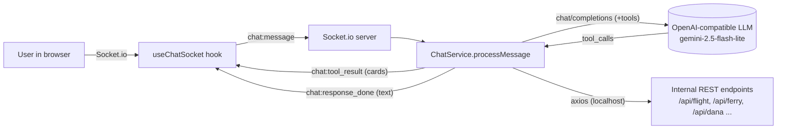
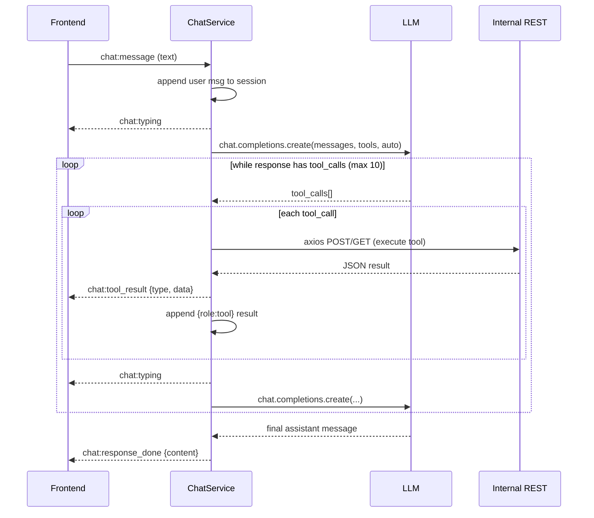

# AI Architecture — TiketQ Conversational Assistant

How the TiketQ AI travel assistant is designed: the model, the tool-calling
agentic loop, the transport, session handling, and the guardrails that keep it
scoped and safe. This document is grounded in `services/chatService.js` (the
backend brain) and the frontend `useChatSocket` / `ChatMessage` layer.

> Related: `docs/WEBHOOKS_AND_SOCKETS.md` (Socket.io + tool payload shapes),
> `docs/API_REFERENCE.md` (the REST endpoints the tools call), the `tiket-FE`
> `docs/AI_CHATBOT.md` (frontend rendering).

---

## 1. Overview

The assistant is an **agentic, tool-calling chatbot** that can search flights and
ferries, take bookings end to end, generate a payment, and look up an existing
booking — entirely inside a chat conversation. It is not a retrieval bot: it
acts on the real booking APIs through a constrained set of function tools and
streams rich UI cards (not text lists) back to the browser.

Design goals:

- **Conversational booking** — collect passenger details in natural language,
  never send the user to a form.
- **Grounded actions** — every capability is a typed tool backed by a real REST
  endpoint; the model cannot act outside that tool surface.
- **Rich UI, thin text** — search/booking/payment results render as cards; the
  model only narrates.
- **Scoped and safe** — a strict domain guardrail, a bounded reasoning loop, and
  server-side money handling.

---

## 2. High-level architecture

The model never talks to the outside world directly. It emits **tool calls**;
`ChatService` executes them against the backend's own REST endpoints over
`127.0.0.1`, feeds the results back to the model, and forwards a display-ready
card to the frontend.

---

## 3. Model & provider

Configured in `getOpenAI()`:

| Setting | Source | Notes |
|---|---|---|
| SDK | `openai` (Node) | Standard OpenAI client, pointed at a compatible gateway |
| `apiKey` | `SUMOPOD_API_KEY` | **Not** the standard `OPENAI_API_KEY` |
| `baseURL` | `AI_BASE_URL` | OpenAI-compatible endpoint |
| Model | `AI_MODEL` (default `gemini/gemini-2.5-flash-lite`) | Passed on every completion call |
| Tool mode | `tool_choice: "auto"` | Model decides when to call tools |

The client is lazily instantiated and reused (module-level singleton).

---

## 4. Transport & session management

**Transport is Socket.io**, not HTTP — the entire conversation is event-driven:

| Direction | Event | Payload |
|---|---|---|
| client → server | `chat:message` | user text (+ client `sessionId`) |
| server → client | `chat:typing` | (none) — shown while the model/tools work |
| server → client | `chat:tool_result` | `{ type, data }` — a card to render |
| server → client | `chat:response_done` | `{ content }` — the model's final text |
| server → client | `chat:error` | `{ message }` |

**Sessions** are held in an in-memory `Map` on `ChatService`, keyed by a
client-supplied `sessionId`:

- On first use, a session is seeded with a **system prompt** (see §6) that
  injects the current date/tomorrow so relative dates resolve correctly.
- Each turn appends `{ role: "user" }`, the model's messages, and `{ role: "tool" }`
  results to `session.messages`.
- `trimMessages()` caps history at the **system message + last 20 messages** to
  bound context growth.
- A sweep every 30 minutes evicts sessions idle for **> 2 hours**.

> ⚠️ The `sessionId` is generated client-side (`useChatSocket`) and is not
> cryptographically strong; session state lives only in the process memory of a
> single instance. See §9.

---

## 5. The agentic loop (tool calling)

`ChatService.processMessage(sessionId, messageText, socket)` runs a bounded
reason-act loop:

Key properties:

- **`MAX_ITERATIONS = 10`** — a hard ceiling on tool-call rounds per user turn.
  Exceeding it emits `chat:error` and breaks, preventing runaway loops/cost.
- Each tool call produces **two outputs**: a `chat:tool_result` card streamed to
  the UI, *and* a JSON string returned into the model's context so it can reason
  about what happened and narrate.
- Errors inside a tool are caught and returned to the model as
  `{ error: ... }` rather than crashing the loop.

---

## 6. Tool catalog

Eight tools are declared (`tools` array). Each is a typed function; the model
fills the parameters, `handleToolCall()` executes it against an internal REST
endpoint over `http://127.0.0.1:${PORT}`, and emits a typed card.

| # | Tool | Purpose | Backend call | Card `type` |
|---|---|---|---|---|
| 1 | `search_flights` | Flights for a date (assumes 1 adult) | `POST /api/flight/search` | `flight_results` |
| 2 | `search_cheapest_flight_in_range` | Cheapest across a date range (**capped at 14 days**) | `POST /api/flight/search` ×N (parallel) | `flight_results` |
| 3 | `search_ferry_trips` | Batam⇄Singapore ferry search | `POST /api/ferry/...` | `ferry_results` |
| 4 | `execute_flight_booking` | Create a real flight booking | flight booking endpoint | (booking result) |
| 5 | `execute_ferry_booking` | Create a real ferry booking (needs passport data) | ferry booking endpoint | (booking result) |
| 6 | `generate_dana_payment` | Create a DANA **bank VA** payment for a booking | `POST /api/dana/create-order` | `dana_payment` |
| 7 | `get_booking_info` | Look up an existing booking | `GET /api/flight/book-info/:code` | `booking_summary` |
| 8 | `show_customer_service` | Show the support contact card | (none) | `customer_service_card` |

Notes:

- **Amounts are never model- or client-supplied.** `generate_dana_payment` sends
  only `{ bookingNo, payMethod }`; `/api/dana/create-order` derives the charge
  from the stored booking. `payMethod` is restricted to the working bank VAs
  (`BNI | BRI | MANDIRI | CIMB | PANIN`, default `BNI`) — the chat card renders a
  virtual-account number. (QRIS and BCA are not offered; the DANA-wallet redirect
  method isn't used in chat because the card renders a VA number, not a redirect.)
- Search tools compute `cheapest`/`earliest`/`latest` highlights server-side and
  only forward a bounded set of options.

---

## 7. Guardrails & safety

Guardrails are enforced at several layers, not just the prompt:

**Prompt-level (system message):**

- **Domain lock** — *"STRICTLY a travel and ticketing assistant… MUST NOT answer
  questions, write code, provide financial/medical advice, or engage in ANY topic
  outside flights, ferries, travel bookings, and TiketQ services… Do NOT bypass
  this guardrail."* Off-topic requests are declined and redirected.
- **Language mirroring** — always reply in the user's language (ID/EN).
- **No internal-ID leakage** — never expose or ask for `searchId`/`tripId`; they
  are resolved from the selected card.
- **Card-not-text rule** — must not enumerate options in prose; the UI renders
  them.
- **Conversational data capture** — must collect name/email/phone/DOB (and full
  passport details for ferries) in chat before booking; never defer to a form.
- **Date grounding** — today/tomorrow/year are injected so relative dates resolve
  deterministically instead of being hallucinated.
- **Explicit no-results contract** — must state origin/destination/date and
  suggest nearby airports when a search is empty.

**Code-level (hard limits, independent of the model):**

- **Bounded agent loop** — `MAX_ITERATIONS = 10` caps tool rounds per turn.
- **Range cap** — `search_cheapest_flight_in_range` iterates at most **14 days**
  to bound fan-out API calls.
- **Server-authoritative money** — payment amount comes from the stored booking,
  not the conversation; the payment tool cannot be talked into a different price.
- **History cap** — `trimMessages()` bounds context to the last 20 messages.
- **Tool sandbox** — the model can only reach the eight declared tools; it has no
  arbitrary code, shell, or network capability.
- **Error containment** — tool exceptions are returned to the model as data; API
  errors don't crash the socket.

---

## 8. Frontend rendering of tool results

The browser (`ChatBot/useChatSocket.ts` + `ChatMessage.tsx`) treats
`chat:tool_result` as a discriminated union on `type` and renders a card per
kind: `flight_results`, `ferry_results`, `booking_summary`, `dana_payment`
(VA number / QR), and `customer_service_card`. The model's `chat:response_done`
text is shown as the narration above/around the card. Selecting a card sends a
follow-up `chat:message` (e.g. passenger counts) back into the same session.

---

## 9. Known limitations & hardening backlog

Stated plainly so the design isn't mistaken for more than it is:

- **Session identity is weak** — `sessionId` is a short, non-cryptographic
  client value, and session state (including booking context and generated
  payment cards) is keyed on it in process memory. A guessed/collided id could
  cross conversations. → Use a server-issued/`crypto.randomUUID()` id and/or
  bind sessions to a socket/auth principal.
- **In-memory, single-instance state** — sessions are lost on restart and not
  shared across instances; horizontal scaling would split conversations. → Move
  session state to Redis.
- **Prompt-only content guardrail** — the domain lock is instruction-based, so
  it is susceptible to prompt injection (including via tool-result content) and
  has no independent moderation/output filter. → Add an input/output moderation
  pass and treat tool output as untrusted.
- **Tools call internal APIs unauthenticated over localhost** — fine as an
  internal call, but the chat path can trigger real bookings; consider an
  internal auth/service token and per-session rate limits on booking/payment
  tools.
- **No streaming of tokens** — responses are delivered per-turn
  (`chat:response_done`), not streamed token-by-token.

---

## 10. Configuration summary

| Env var | Purpose |
|---|---|
| `SUMOPOD_API_KEY` | API key for the OpenAI-compatible gateway |
| `AI_BASE_URL` | Base URL of the gateway |
| `AI_MODEL` | Model id (default `gemini/gemini-2.5-flash-lite`) |

All three are validated at startup alongside the other required env (see
`docs/DANA_INTEGRATION.md` / the project `CLAUDE.md`).
