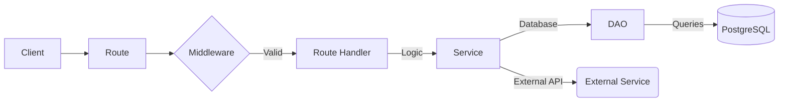

# 🏗️ Architecture & Tech Stack

The TiketQ Bosbiller is built using a modern JavaScript stack focused on performance, type safety (via Prisma), and scalability.

## 🛠️ Technology Stack

- **Runtime**: [Node.js](https://nodejs.org/) (v14.x or higher)
- **Framework**: [Express.js](https://expressjs.com/)
- **ORM**: [Prisma](https://www.prisma.io/) (PostgreSQL)
- **Database**: [PostgreSQL](https://www.postgresql.org/)
- **Caching**: [Redis](https://redis.io/) (via `redis` client)
- **Authentication**: [JWT](https://jwt.io/) (JSON Web Tokens)
- **Documentation**: [Swagger UI](https://swagger.io/tools/swagger-ui/) (via `swagger-ui-express`)
- **Payments**: [Midtrans](https://midtrans.com/) Integration

## 📂 Directory Structure

```text
tiketq-bosbiller/
├── bin/                # Server entry point (www)
├── db/                 # Database initialization, DAOs, and seeds
│   ├── dao/            # Data Access Objects (Business logic abstraction)
│   └── seeds/          # Database seed scripts (e.g., Admin user)
├── middleware/         # Custom Express middleware (Auth, Error handling)
├── prisma/             # Prisma schema and migrations
├── routes/             # API route definitions
│   ├── api/            # Centralized API logic (Auth, flight, ferry, car)
│   └── webhooks/       # External service webhooks (Midtrans)
├── services/           # External API service wrappers
├── uploads/            # Local storage for uploaded assets
├── utils/              # Helper functions and core utilities
├── app.js              # Express app configuration
└── swagger.yaml        # API specification file
```

## 🔄 Core Patterns

We follow a **Router-DAO-Service** pattern to maintain a clean separation of concerns:

1.  **Routes** (`routes/api/`): Define endpoints, handle requests/responses, and apply middleware.
2.  **DAO** (`db/dao/`): Data Access Objects handle all interactions with the database via Prisma (PostgreSQL).
3.  **Services** (`services/`): Handle complex business logic, PDF generation, email dispatches, and external API requests (e.g., Sindo Ferry, Midtrans, Flight provider).

### Example Data Flow



> [!NOTE]
> For highly detailed transaction lifecycles, sequential flow charts, and email/PDF rendering dataflows for both services, see the comprehensive [Flight & Ferry Booking Dataflow Document](./dataflow.md).

---

## ⚡ High-Speed Caching & Latency Optimizations

To deliver highly responsive travel checkout flows, the Sindo Ferry modules implement advanced latency-reduction architectures:

### 1. Unified Search Gateway
* **Problem**: The frontend application uses a single e-ticket search field pointing to `/api/flight/book-info/:code`. Rebuilding the React client to handle distinct flight and ferry search endpoints is highly expensive.
* **Solution**: The flight search gateway `routes/api/flight/bookinfo/index.js` intercepts all incoming requests. If the requested booking number belongs to a local Sindo Ferry booking:
  1. Queries PostgreSQL via `FerryBookingDAO`.
  2. Dynamically generates the high-fidelity orange-branded PDF e-ticket on the fly.
  3. Maps the relational ferry data structures into a flight-compatible adapter JSON payload (featuring passenger detail lists, duration summaries, and the base64-encoded PDF).
  4. Returns the payload seamlessly to the client, allowing the native React `/eticket` UI to render and download ferry voyages immediately.

### 2. Upstream API Caching (`utils/ferryCache.js`)
To bypass Sindo Ferry's network delays, a localized caching layer powered by `node-cache` is integrated:
* **Active Trip Searches** (`trips:${embarkation}:${destination}:${date}`): Cached for **5 minutes** (300 seconds), ensuring rapid subsequent paging searches.
* **Master Sectors, Routes, & Countries**: Cached for **24 hours**, as master records are highly stable.
* This yields **up to an 85% drop in API response latencies** under peak user checkouts.

### 3. Parallel Process Execution
To prevent consecutive blocking calls during booking creation (`POST /api/ferry/booking/`):
* **Master Metadata Loading**: Routes and countries list are fetched concurrently using `Promise.all` instead of sequentially.
* **Passenger Registry Additions**: Passenger details addition requests (`POST /Agent/Booking/Bookings/{id}/Details`) are dispatched in parallel via `Promise.all` instead of standard sequential loops, collapsing submission delays from $N \times 1.5\text{s}$ down to a flat $\sim1.5\text{s}$ in total.

### 4. Dynamic PDF Formatting System (`services/ferryPdfService.js`)
* Generates pixel-perfect e-tickets matching TiketQ's branding.
* Measures text dimensions dynamically via `doc.heightOfString(...)` for variable parameters (e.g. terminal names, booking IDs, passenger lists).
* Computes timeline coordinates dynamically to prevent text overlapping.

---

## 🔐 Security

- **JWT Authentication**: All protected routes require a `Bearer` token.
- **Admin Access**: Restricted routes use the `ensure-admin.js` middleware.
- **Rate Limiting Security**: Custom, memory-efficient rate-limiting middleware (`middleware/rate-limiter.js`) backed by `node-cache` applied to all `/api` routes (blocks scrapers, crawling bots, and brute force requests by enforcing a default limit of 120 requests per minute per IP address).
- **Environment Secrets**: Sensitive data (Database URLs, API Keys) is managed via `.env` files.
