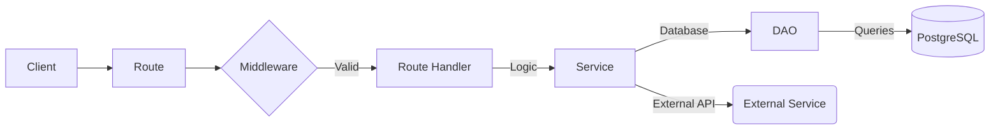

# 🏗️ Architecture & Tech Stack

The TiketQ Bosbiller is built using a modern JavaScript stack focused on performance, type safety (via Prisma), and scalability.

## 🛠️ Technology Stack

- **Runtime**: [Node.js](https://nodejs.org/) (v14.x or higher)
- **Framework**: [Express.js](https://expressjs.com/)
- **ORM**: [Prisma](https://www.prisma.io/) (PostgreSQL)
- **Database**: [PostgreSQL](https://www.postgresql.org/)
- **Caching**: [Redis](https://redis.io/) (via `redis` client)
- **Authentication**: [JWT](https://jwt.io/) (JSON Web Tokens)
- **Documentation**: [Swagger UI](https://swagger.io/tools/swagger-ui/) (via `swagger-ui-express`)
- **Payments**: [Midtrans](https://midtrans.com/) Integration

## 📂 Directory Structure

```text
tiketq-bosbiller/
├── bin/                # Server entry point (www)
├── db/                 # Database initialization, DAOs, and seeds
│   ├── dao/            # Data Access Objects (Business logic abstraction)
│   └── seeds/          # Database seed scripts (e.g., Admin user)
├── middleware/         # Custom Express middleware (Auth, Error handling)
├── prisma/             # Prisma schema and migrations
├── routes/             # API route definitions
│   ├── api/            # Centralized API logic (Auth, flight, ferry, car)
│   └── webhooks/       # External service webhooks (Midtrans)
├── services/           # External API service wrappers
├── uploads/            # Local storage for uploaded assets
├── utils/              # Helper functions and core utilities
├── app.js              # Express app configuration
└── swagger.yaml        # API specification file
```

## 🔄 Core Patterns

We follow a **Router-DAO-Service** pattern to maintain a clean separation of concerns:

1.  **Routes** (`routes/api/`): Define endpoints, handle requests/responses, and apply middleware.
2.  **DAO** (`db/dao/`): Data Access Objects handle all interactions with the database via Prisma.
3.  **Services** (`services/`): Handle complex business logic and external API calls (e.g., fetching flight data from third-party APIs).

### Example Data Flow



## 🔐 Security

- **JWT Authentication**: All protected routes require a `Bearer` token.
- **Admin Access**: Restricted routes use the `ensure-admin.js` middleware.
- **Environment Secrets**: Sensitive data (Database URLs, API Keys) is managed via `.env` files.
