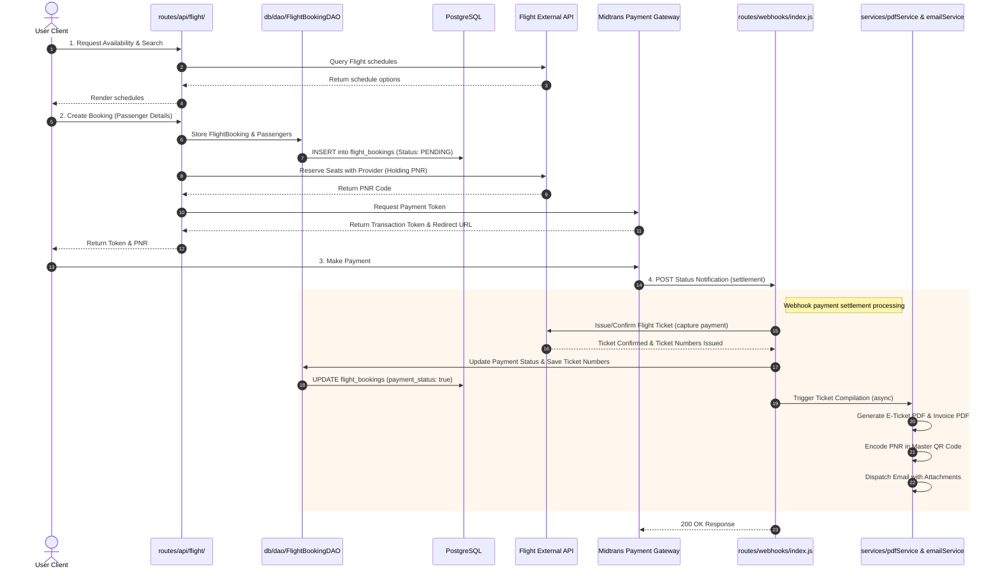
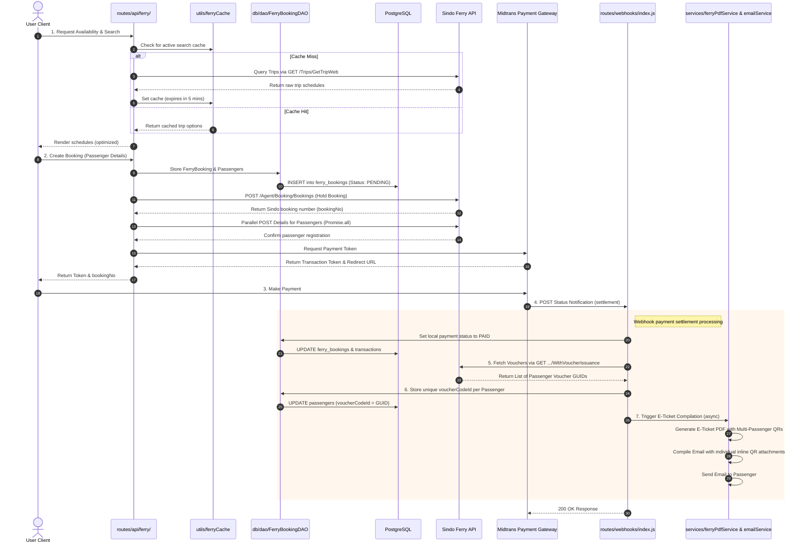
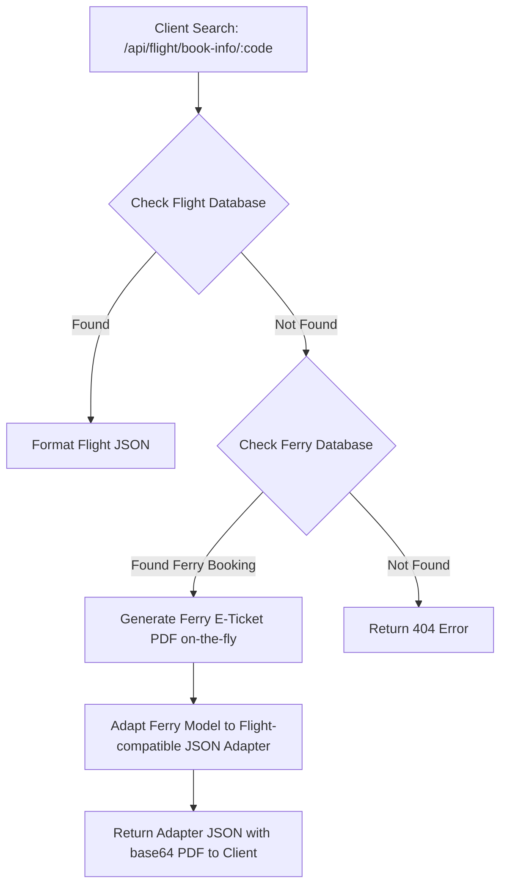

# 🔄 Flight & Ferry Booking Dataflow

This document describes the complete end-to-end dataflow and transactional lifecycle for both **Flight** and **Ferry** bookings within the TiketQ Bosbiller ecosystem.

---

## ✈️ Flight Booking Lifecycle & Dataflow

Flight bookings utilize direct provider API channels integrated with our local transaction store and Midtrans payment checkout gateways.

### Flowchart: End-to-End Flight Lifecycle

### Detailed Flight Dataflow Steps

1.  **Search & Pricing**: The user searches flights via `routes/api/flight/search/index.js`. Real-time inventory and pricing are retrieved upstream from the external Flight API.
2.  **Booking Creation (Pending)**: The user submits passenger details to `routes/api/flight/book/index.js`.
    -   The system persists a new `FlightBooking` record and associated `Passenger` and `Transaction` records in the local database with `status: "PENDING"` via `FlightBookingDAO`.
    -   A temporary holding seat reservation is booked upstream.
    -   A checkout payload is dispatched to Midtrans, returning a secure payment token and redirect URL.
3.  **Payment Capture & Webhook Settlement**: The customer settles their bill on the Midtrans gateway. Midtrans dispatches a webhook to `routes/webhooks/index.js`.
    -   **Provider Issuance**: If the transaction is approved (`settlement` or `capture`), the webhook initiates an upstream `payment` issue request via `apiService.fetchData()` to lock in the actual flight tickets.
    -   **DB Commit**: The system updates `payment_status` to `true` in PostgreSQL.
    -   **PDF Generation**: Under `services/pdfService.js`, an A4 Flight E-ticket PDF and a professional invoice PDF are dynamically compiled. The master QR code on the top-right of the E-ticket encodes the unique flight booking PNR.
    -   **Email Dispatch**: In `services/emailService.js`, the ticket PDF and Invoice PDF are attached, and a gorgeous HTML confirmation email is dispatched to the user.

---

## 🚢 Ferry Booking (Sindo Ferry) Lifecycle & Dataflow

Ferry bookings utilize the official Sindo Ferry merchant adapter integrated with localized caching, parallel processing, and individual passenger QR voucher code mapping.

### Flowchart: End-to-End Ferry Lifecycle

### Detailed Ferry Dataflow Steps

1.  **Search & Caching**: The user queries ferry schedules via `routes/api/ferry/trips/index.js`.
    -   The system checks the memory cache via `utils/ferryCache.js` for key `trips:${embarkation}:${destination}:${date}`.
    -   If a cache miss occurs, the system makes a secure API request to Sindo Ferry's `/Trips/GetTripWeb` endpoint, parses and normalizes the payload, and caches the result for 5 minutes.
2.  **Booking Creation (Pending)**: The user submits passenger metadata and passport details to `routes/api/ferry/booking/index.js`.
    -   **Parallel Master Loading**: Available sectors and country GUID lists are fetched concurrently via `Promise.all` utilizing cache lookups to fuzzy-match and normalize passenger details.
    -   **Local DB Persistence**: A new `FerryBooking` record, its related `Passenger` records, and a transaction row are committed to the local database with a status of `PENDING` via `FerryBookingDAO`.
    -   **Ferry Booking Submission**: A `POST` request is sent to Sindo Ferry's `/Agent/Booking/Bookings` endpoint to create a temporary holding ticket.
    -   **Parallel Passenger Registration**: Sindo Ferry requires a separate `POST` request for each passenger's passport/metadata detail. To avoid $N \times 1.5\text{s}$ consecutive latencies, these requests are dispatched concurrently using `Promise.all`.
    -   **Payment Token Generation**: The service issues a checkout token from Midtrans and returns it along with the official `bookingNo` to the frontend client.
3.  **Payment Capture & Webhook Settlement**: The user pays via Midtrans, which triggers a status POST to `routes/webhooks/index.js`.
    -   **DB Status Update**: The handler sets the booking and transaction statuses to `PAID` via `FerryBookingDAO.updatePaymentStatusByNo()`.
    -   **Passenger Voucher Issuance**: To fetch the official individual passenger ticket codes, the system calls Sindo Ferry's `GET /agent/Order/Orders/{bookingNo}/WithVoucherIssuance` API.
    -   **Sequential Mapping**: The external API returns an array of passenger ticket vouchers in the exact sequential order of their registration index. The handler loops through the passengers array, maps `vouchers[i].voucherCodes[0].id` to `passengers[i]`, and writes the unique GUID string to the `voucherCodeId` column in the database via `FerryBookingDAO.updatePassengerVoucher()`.
4.  **Multi-QR E-Ticket PDF Rendering**:
    -   The E-ticket generator in `services/ferryPdfService.js` compiles a professional, orange-branded A4 voucher.
    -   **Master QR Code**: The top-right master QR code encodes the first passenger's unique `voucherCodeId` (falling back to the general `bookingNo` if undefined).
    -   **Individual Table Row QR Codes**: Inside the passenger details table, a custom column displays a 35x35 QR code generated on the fly for *each* passenger row, encoding their respective unique voucher GUID (`voucherCodeId`).
5.  **Multi-QR Email Notification**:
    -   The email service in `services/emailService.js` generates passenger-specific inline QR code data attachments with matching Content IDs: `qrcode-pax-${i}@tiketq.com`.
    -   The HTML template renders individual QR code attachments inside the Passenger details table row next to passport/nationality details, and places the first passenger's unique voucher ID inside the header QR code.
    -   The email is sent asynchronously with both the E-ticket and Invoice PDFs attached.

---

## 🔍 Unified Search & Retrieval Gateway Flow

To support rapid, unified lookup of both flight and ferry bookings using a single search input, a centralized adapter flow is established in `routes/api/flight/bookinfo/index.js`.

### Detailed Search Adapter Dataflow

1.  **Unified Input Endpoint**: The frontend calls a single endpoint: `GET /api/flight/book-info/:code`.
2.  **Flight Lookup**: The controller checks PostgreSQL via `FlightBookingDAO`. If found, it returns the standard flight booking structure.
3.  **Ferry Lookup & Dynamic Transformation**: If no flight matches the search query:
    -   The controller queries PostgreSQL using `FerryBookingDAO.findBookingByNo()`.
    -   If a ferry booking is found, the system invokes `generateFerryTicketPDF()` on-the-fly to render the latest multi-QR code A4 document.
    -   The system maps the relational ferry database properties (origin, destination, date, passengers, transaction metadata) into a flight-structured interface (e.g. mapping `bookingNo` to `bookingCode` and embedding the passenger details).
    -   The adapted JSON, containing the base64-encoded PDF buffer under a standard key, is returned to the client.
4.  **Client Render**: The React frontend renders the standard travel eticket display and provides an immediate PDF download button without requiring any frontend code changes.
