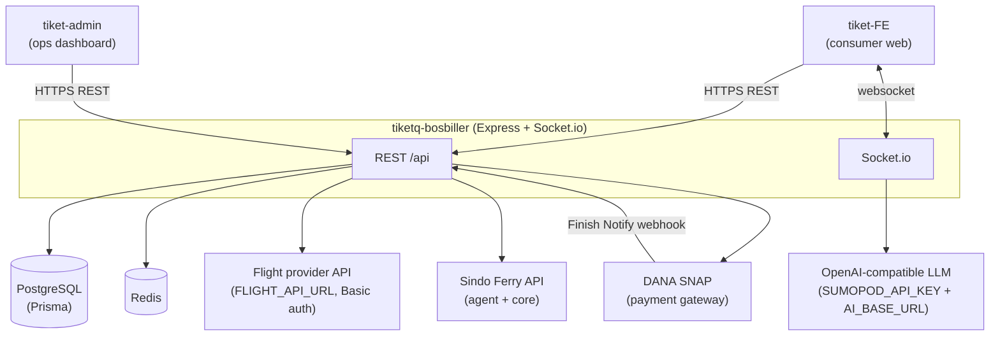

# 01 — Architecture

See [`00-OVERVIEW.md`](00-OVERVIEW.md) for product scope and glossary.

## 1. Technology Stack

| Concern | Choice | Evidence |
|---------|--------|----------|
| Runtime | Node.js | `bin/www`, CommonJS modules throughout |
| HTTP framework | Express `~4.16` | `app.js` |
| ORM / DB | Prisma `^6.19` over **PostgreSQL** | `prisma/schema.prisma`, `db/index.js` |
| Cache | **Redis** (`redis` `^4.6`) + in-process `node-cache` | `utils/redisClient.js`, `utils/ferryCache.js`, `utils/node-cache.js` |
| Real-time | **Socket.io** `^4.8` | `socket.js`, initialized in `bin/www` |
| Auth | `jsonwebtoken` (HS256) + `bcryptjs` | `db/dao/UserDAO.js`, `middleware/authMiddleware.js` |
| Payments | DANA SNAP via `dana-node` `^2.1` | `services/danaService.js` |
| AI chat | `openai` `^6` SDK against an OpenAI-compatible endpoint | `services/chatService.js` |
| PDF / email | `pdfkit`, `qrcode`, `nodemailer` | `services/pdfService.js`, `ferryPdfService.js`, `invoiceService.js`, `emailService.js` |
| Uploads | `multer` (disk storage) | `routes/api/car-rental/index.js` |
| Validation | `express-validator` | `middleware/validate.js` |
| API docs | `swagger-ui-express` at `/api-docs` (from `swagger.yaml`) | `app.js` |

> Note: `package.json` also lists `mongoose`. **No Mongo/Mongoose code is used** anywhere; the sole database
> is PostgreSQL via Prisma. Treat `mongoose` as a vestigial dependency.

## 2. System Context



External dependencies, all called only from the backend:

- **Flight provider** — `FLIGHT_API_URL` with HTTP Basic auth (`API_KEY`:`SECRET_KEY`). See [`05-INTEGRATIONS.md`](05-INTEGRATIONS.md).
- **Sindo Ferry** — two base URLs: `FERRY_URL` (agent API) and `FERRY_CORE_URL` (core/trip API); bearer-token auth cached for 24h.
- **DANA** — `DANA_API_BASE_URL` SNAP gateway; asymmetric RSA signing. See [`04-PAYMENTS-DANA.md`](04-PAYMENTS-DANA.md).
- **LLM** — OpenAI-compatible chat-completions endpoint for the assistant. See [`05-INTEGRATIONS.md`](05-INTEGRATIONS.md).

## 3. Layered Structure

```
HTTP request
  → routes/…            (Express routers: parse, validate, orchestrate, shape response)
    → services/…        (business logic: DANA, fulfillment, chat, PDF, email, provider calls)
      → db/dao/…        (the ONLY place Prisma is touched)
        → Prisma Client → PostgreSQL
```

- **Routes** own request/response shaping and cross-service orchestration. Ferry/flight routes also call the
  third-party provider utilities directly (`routes/api/ferry/utils.js`, `utils/axios-request.js`).
- **Services** hold reusable logic that spans multiple routes or providers (`danaService`, `bookingFulfillment`,
  `chatService`, `apiService`, PDF/email/invoice generators).
- **DAOs** wrap all Prisma access behind intention-revealing methods (`claimForPayment`, `createBooking`, …).

## 4. The DAO Pattern (mandatory)

All database access **must** go through a DAO class in `db/dao/`. Controllers must not construct their own
Prisma queries for the general booking/transaction/user flow. The DAOs are singletons exporting an instance:

| DAO | Responsibility |
|-----|----------------|
| `UserDAO` | Users, bcrypt hashing, JWT issuance |
| `FlightBookingDAO` | Flight bookings, atomic payment claim, ticket flags |
| `FerryBookingDAO` | Ferry bookings, terminals, atomic payment claim, voucher writes |
| `TransactionDAO` | Transaction lookup with all booking relations, status update |
| `CarDAO` | Cars, photos, rental requests |

**Known, deliberate exceptions (documented, not hidden):** the admin analytics/ops routes use the shared Prisma
client directly for aggregation and dashboards that have no DAO method:

- `routes/api/admin/index.js` — `require("../../../db/index")` then `prisma.transaction.findMany / count /
  groupBy`, `prisma.car.count`, `prisma.flightBooking.findMany`, etc. (stats, logs, upcoming-schedules).
- `routes/api/history/index.js` — `prisma.transaction.findMany` for guest history.
- `routes/api/health/index.js` — instantiates its own `PrismaClient` for a `SELECT 1` liveness probe.

These are read/aggregate paths; the transactional booking/payment paths remain DAO-only. The direct-Prisma
usage in admin is called out again in [`07-SECURITY-AND-AUTH.md`](07-SECURITY-AND-AUTH.md).

## 5. Directory Map

```
tiketq-bosbiller/
├── app.js                      # Express app: middleware, static, swagger, DB/Redis/ferry bootstrap, routes
├── bin/www                     # HTTP server bootstrap; PORT (default 3001); Socket.io init
├── socket.js                   # Socket.io init(), getIo(), chat + visitor events
├── prisma/schema.prisma        # Data model (see 02-DATA-MODEL.md)
├── routes/
│   ├── index.js                # mounts /api behind a rate limiter
│   ├── protectedRoutes.js      # mounts /api/payment and /api/flight/bookings (authed)
│   └── api/
│       ├── index.js            # domain router table
│       ├── auth/               # login/register/admin-login/me + admin user CRUD
│       ├── flight/             # airports, airlines, search, book, book-info, payment, bookings, booking-data
│       ├── ferry/              # agent, booking, master, order, credit, trips (+ utils.js)
│       ├── car-rental/         # cars, photos, rental requests (multer uploads)
│       ├── dana/               # POST /create-order
│       ├── dana-notify-callback.js  # DANA Finish Notify webhook
│       ├── history/            # guest history by email
│       ├── admin/              # transactions/stats/health/logs/users (+ server.js ops console)
│       ├── health/             # deep health check
│       ├── proxy/              # dev passthrough to flight provider
│       └── payment/            # (empty router file — see note below)
├── services/                   # danaService, bookingFulfillment, chatService, apiService, searchService,
│                               #   pdfService, ferryPdfService, invoiceService, emailService
├── db/
│   ├── index.js                # Prisma client + connectDB()
│   ├── dao/                    # UserDAO, FlightBookingDAO, FerryBookingDAO, TransactionDAO, CarDAO
│   └── seeds/seedAdmin         # seeds DEFAULT_USER admin at boot
├── middleware/                 # authMiddleware, adminMiddleware, error-handler, rate-limiter, validate, ensure-token
├── utils/                      # axios-request (flight provider + mock), redisClient, node-cache, ferryCache, …
└── scripts/                    # dana-preflight.js (prestart) + DANA UAT scripts
```

> `routes/api/payment/index.js` is an **empty file**. The live `/api/payment` path is served by
> `routes/protectedRoutes.js`, which mounts `./api/flight/payment` at `/api/payment` (see below).

## 6. Route Mounting

Two independent route trees are mounted in `app.js` in order:

```js
app.use("/", routes);            // routes/index.js
app.use("/", protectedRoutes);   // routes/protectedRoutes.js
```

**Tree A — `routes/index.js`:**
- `GET /` → static 401 "resource restricted".
- `router.use("/api", rateLimiter({ max: 120, windowMs: 60000 }), require("./api"))` — every `/api/*` route is
  rate-limited to 120 req/min/IP.

**`routes/api/index.js`** builds the domain table and mounts each at `/<key>`:

```js
const domains = { flight, auth, ferry, history, "car-rental": …, proxy, health, admin };
Object.entries(domains).forEach(([k, v]) => router.use(`/${k}`, v));
router.use("/dana", require("./dana"));
router.use("/dana-notify-callback", require("./dana-notify-callback"));
router.get("/", …welcome JSON…);
```

Resulting base paths: `/api/flight`, `/api/auth`, `/api/ferry`, `/api/history`, `/api/car-rental`,
`/api/proxy`, `/api/health`, `/api/admin`, `/api/dana`, `/api/dana-notify-callback`.

**Tree B — `routes/protectedRoutes.js`:**
- `router.use("/api/payment", require("./api/flight/payment"))` — flight payment reachable at **`/api/payment`**
  *and* at `/api/flight/payment` (the flight sub-router also mounts it). Neither path is behind `authMiddleware`.
- `router.use("/api/flight/bookings", authMiddleware, require("./api/flight/flight-bookings"))` — this authed
  mount shadows the same path that the flight sub-router mounts *without* auth; Express matches the first
  registered handler, so the effective behavior depends on mount order (documented in [`03-API-REFERENCE.md`](03-API-REFERENCE.md)).

**App bootstrap side-effects** (`app.js`, IIFE at startup): `connectDB()`, `seedAdmin()`, initialize the Redis
client, and pre-warm the Sindo Ferry token via `utils/node-cache`. CORS allows only `localhost`/`127.0.0.1`
origins in-process (production CORS is delegated to Nginx). Error handling is via `notFoundHandler` +
`errorHandler` (see [`07-SECURITY-AND-AUTH.md`](07-SECURITY-AND-AUTH.md)).
