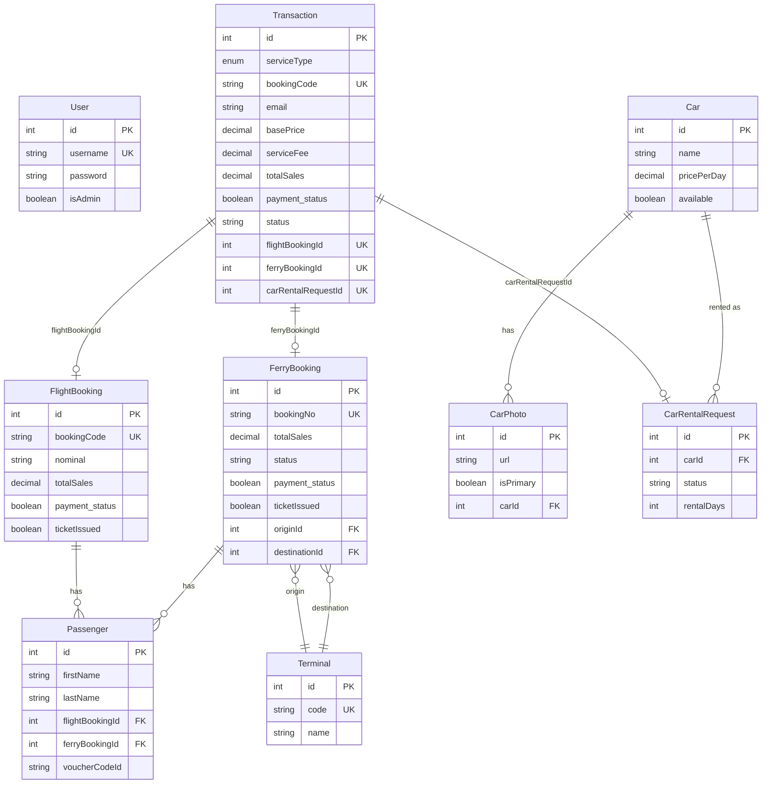

# 02 — Data Model

Source of truth: `prisma/schema.prisma` (provider `postgresql`, datasource URL from `DATABASE_URL`).
All DB access is through the DAOs described in [`01-ARCHITECTURE.md`](01-ARCHITECTURE.md).

## 1. Entity-Relationship Diagram



## 2. Models

### `User` → table `users`
| Field | Type | Notes |
|-------|------|-------|
| `id` | Int PK | autoincrement |
| `username` | String | **unique** |
| `password` | String | bcrypt hash (never returned by the safe `select` used in `UserDAO`) |
| `isAdmin` | Boolean | default `false`; drives `adminMiddleware` |
| `createdAt`/`updatedAt` | DateTime | |

### `Transaction` → table `transactions`
The unifying financial/ownership record. Exactly one of the three booking FKs is set per row.

| Field | Type | Notes |
|-------|------|-------|
| `id` | Int PK | |
| `serviceType` | `ServiceType` enum | `FLIGHT` \| `FERRY` \| `CAR_RENTAL` |
| `bookingCode` | String? | **unique**; mirrors the owning booking's code/number |
| `email` | String? | |
| `basePrice`, `serviceFee`, `totalSales` | Decimal? | default `0`; `totalSales` is the authoritative charge amount |
| `payment_status` | Boolean | default `false` |
| `status` | String? | default `"PENDING"`; also `"PAID"`, `"CANCELLED"`, `"REFUNDED"`, `"TICKET_FAILED"` (set by code, not an enum) |
| `flightBookingId` | Int? | **unique**, FK → `FlightBooking`, `onDelete: Cascade` |
| `ferryBookingId` | Int? | **unique**, FK → `FerryBooking`, `onDelete: Cascade` |
| `carRentalRequestId` | Int? | **unique**, FK → `CarRentalRequest`, `onDelete: Cascade` |

Because each FK is `@unique`, every relation to a booking is strictly **1:1**.

### `FlightBooking` → table `flight_bookings`
| Field | Type | Notes |
|-------|------|-------|
| `id` | Int PK | |
| `bookingCode` | String? | **unique**; the provider's booking code, also used as `partnerReferenceNo` for DANA |
| `nominal` | String? | provider-echoed amount used for the issue call |
| `basePrice`/`serviceFee`/`totalSales` | Decimal? | `totalSales` is server-authoritative for payment |
| `departureDate`/`origin`/`destination` | String? | provider values stored as strings |
| `email`/`mobile_number`/`name` | String? | buyer contact |
| `payment_status` | Boolean | default `false` |
| `ticketIssued` | Boolean | default `false`; set only after provider confirms issuance |
| `book_date` | DateTime | default now |
| `passengers` | `Passenger[]` | |
| `transaction` | `Transaction?` | back-relation |

### `FerryBooking` → table `ferry_bookings`
| Field | Type | Notes |
|-------|------|-------|
| `id` | Int PK | |
| `bookingNo` | String? | **unique**; the **Sindo Ferry booking GUID**, used as `partnerReferenceNo` for DANA |
| `nominal` | String? | |
| `basePrice`/`serviceFee`/`totalSales` | Decimal? | `totalSales` derived from live Sindo pricing (see [`03-API-REFERENCE.md`](03-API-REFERENCE.md)) |
| `departureDate`/`returnDate` | DateTime? | |
| `originId`/`destinationId` | Int? | FK → `Terminal` (relations `OriginTerminal`/`DestinationTerminal`) |
| `email`/`mobile_number` | String? | |
| `status` | String? | default `"PENDING"` → `"PAID"` |
| `payment_status`/`ticketIssued` | Boolean | default `false` |
| `passengers` | `Passenger[]` | |

### `Passenger` → table `passengers`
| Field | Type | Notes |
|-------|------|-------|
| `id` | Int PK | |
| `title`, `firstName` (req), `lastName` (req) | String | |
| `passportNumber`, `nationality` | String? | |
| `dateOfBirth` | DateTime? | |
| `flightBookingId` | Int? | FK → `FlightBooking`, `onDelete: Cascade`, **`@@index`** |
| `ferryBookingId` | Int? | FK → `FerryBooking`, `onDelete: Cascade`, **`@@index`** |
| `voucherCodeId` | String? | Sindo voucher id stored post-fulfillment |
| `cabinClass` | String? | default `"economy"` |
| `isLapInfant` | Boolean | default `false` |

A passenger belongs to at most one booking (flight *or* ferry); both FKs are nullable.

### `Terminal` → table `terminals`
Ferry ports. `code` **unique**; `name`, `city?`, `country?`. Referenced by `FerryBooking` twice (origin,
destination). Upserted on demand by `FerryBookingDAO.findOrCreateTerminal`.

### `Car` → table `cars`
| Field | Type | Notes |
|-------|------|-------|
| `id` | Int PK | |
| `name`, `type` | String | |
| `rows` | Int | seat rows |
| `pricePerDay` | Decimal | required |
| `pricingDuration` | String? | default `"hari"` |
| `transmission`, `description` | String? | |
| `features` | String[] | Postgres text array |
| `available` | Boolean | default `true` |

### `CarPhoto` → table `car_photos`
`filename`, `url`, `isPrimary` (default false), `carId` FK → `Car` `onDelete: Cascade`, **`@@index([carId])`**.
Only one primary is enforced in application code (`CarDAO.addPhoto` demotes existing primaries).

### `CarRentalRequest` → table `car_rental_requests`
| Field | Type | Notes |
|-------|------|-------|
| `id` | Int PK | |
| `carId` | Int FK → `Car`, `onDelete: Cascade` | |
| `date` | String | requested rental date |
| `fullName`, `phone`, `email` | String | |
| `ktpImage`, `ktpSelfie` | String | URLs of uploaded ID photos |
| `status` | String | default `"PENDING_REVIEW"` → `"APPROVED"` etc. |
| `rentalDays` | Int? | default `1`; multiplied by `pricePerDay` to derive `totalSales` |
| `transaction` | `Transaction?` | created alongside the request |

## 3. Enums

```prisma
enum ServiceType { FLIGHT  FERRY  CAR_RENTAL }
```

`Transaction.status` and booking `status` are **plain strings**, not enums — valid values are established by
code convention (`PENDING`, `PAID`, `CANCELLED`, `REFUNDED`, `TICKET_FAILED`, `PENDING_REVIEW`, `APPROVED`).

## 4. Indexes & Keys

- **Unique:** `User.username`; `Transaction.bookingCode`, `Transaction.flightBookingId`,
  `Transaction.ferryBookingId`, `Transaction.carRentalRequestId`; `FlightBooking.bookingCode`;
  `FerryBooking.bookingNo`; `Terminal.code`.
- **Explicit FK indexes (`@@index`):** `Passenger(flightBookingId)`, `Passenger(ferryBookingId)`,
  `CarPhoto(carId)`.
- **FKs without an explicit secondary index:** `FerryBooking.originId` / `FerryBooking.destinationId`
  reference `Terminal` but carry no `@@index`. Low-cardinality lookups, so acceptable, but worth noting for
  scale planning.

## 5. Migrations

Two migrations exist under `prisma/migrations/`:

| Migration | Purpose |
|-----------|---------|
| `20260309043258_init` | Initial schema |
| `20260328061247_add_car_rental` | Adds the car-rental models |

The Prisma **generator** has no explicit `output`, so the client is generated to the default location —
`npx prisma generate` must be run after install / schema changes (see [`08-DEPLOYMENT.md`](08-DEPLOYMENT.md)).
Fields added since the last migration (e.g. `Car.pricingDuration`, `CarRentalRequest.rentalDays`,
`Passenger.cabinClass`/`isLapInfant`) are present in `schema.prisma`; confirm they are covered by a deployed
migration (`prisma migrate deploy`) or a `db push` before relying on them in production.
