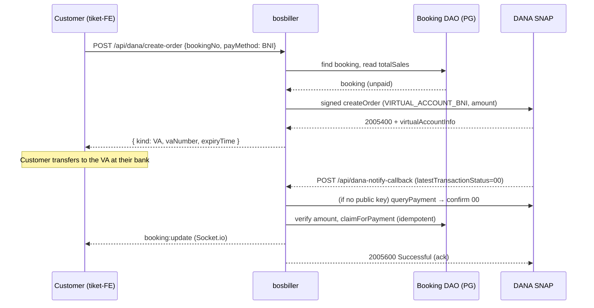
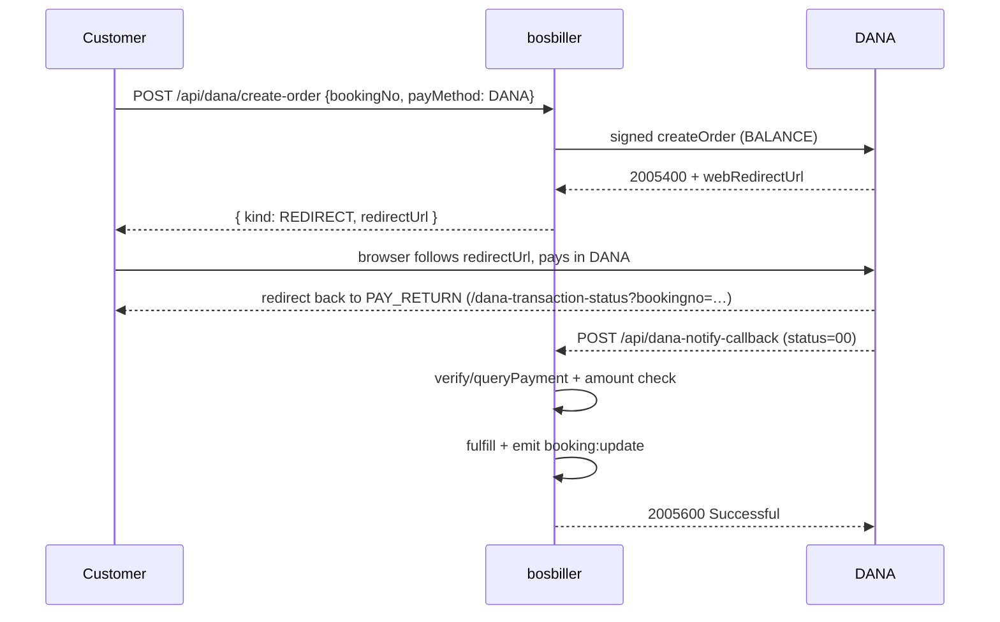

# 04 — Payments (DANA)

DANA is the **only** payment gateway. This section grounds every claim in `services/danaService.js`,
`routes/api/dana/index.js`, `routes/api/dana-notify-callback.js`, and `services/bookingFulfillment.js`.
Endpoint summaries are in [`03-API-REFERENCE.md`](03-API-REFERENCE.md); the notify-driven real-time flow is
also covered in [`06-REALTIME-AND-WEBHOOKS.md`](06-REALTIME-AND-WEBHOOKS.md).

> **No Midtrans.** The former Midtrans flow (and any `/hooks/midtrans` webhook) has been removed. Only DANA
> remains.

## 1. SNAP Asymmetric Signing Model

DANA uses Indonesia's SNAP standard with **asymmetric RSA-SHA256** signatures:

- Requests are signed with the merchant **private key** (`DANA_PRIVATE_KEY`) over a canonical string-to-sign
  (`HTTP-METHOD:relativeURL:SHA256(body):timestamp`), via
  `DanaSignatureUtil.generateSnapB2BScenarioSignature(...)` from `dana-node/runtime`.
- The shared `dana` client (`new Dana({ partnerId: DANA_CLIENT_ID, privateKey: DANA_PRIVATE_KEY, origin,
  env })`) is used for SDK calls (`createOrder`, `queryPayment`).
- Outbound headers on the raw create-order fetch: `X-PARTNER-ID`, `X-CLIENT-KEY` (both `DANA_CLIENT_ID`),
  `CHANNEL-ID: 95221`, `X-EXTERNAL-ID` (a `crypto.randomUUID()`), `X-TIMESTAMP` (GMT+7), `X-SIGNATURE`, `ORIGIN`.
- **Inbound** notify verification uses DANA's **public** key (`DANA_WEBHOOK_PUBLIC_KEY` /
  `DANA_WEBHOOK_PUBLIC_KEY_PATH`) — DANA signs the notify with *its* key, not the merchant's. When the public
  key is unset, verification is skipped and each notification is instead confirmed via a signed `queryPayment`
  call (see §4).
- Timestamps and `validUpTo` are formatted in **GMT+7** as `YYYY-MM-DDTHH:mm:ss+07:00`.
- The startup **preflight** (`scripts/dana-preflight.js`, `prestart`) verifies the private key can produce a
  non-empty signature before the server boots. See [`08-DEPLOYMENT.md`](08-DEPLOYMENT.md).

## 2. Create Order — `POST /api/dana/create-order`

Request: `{ bookingNo, payMethod }`.

### Supported methods (`PAY_METHOD_MAP` in `danaService.js`)
| `payMethod` | DANA `payMethod` / `payOption` | Result kind |
|-------------|-------------------------------|-------------|
| `DANA` | `BALANCE` / (none) | **REDIRECT** — returns `webRedirectUrl` to DANA app/checkout |
| `BNI` | `VIRTUAL_ACCOUNT` / `VIRTUAL_ACCOUNT_BNI` | **VA** |
| `BRI` | `VIRTUAL_ACCOUNT` / `VIRTUAL_ACCOUNT_BRI` | **VA** |
| `MANDIRI` | `VIRTUAL_ACCOUNT` / `VIRTUAL_ACCOUNT_MANDIRI` | **VA** |
| `CIMB` | `VIRTUAL_ACCOUNT` / `VIRTUAL_ACCOUNT_CIMB` | **VA** |
| `PANIN` | `VIRTUAL_ACCOUNT` / `VIRTUAL_ACCOUNT_PANI` | **VA** |

**Removed / unsupported:** QRIS, BCA, BTPN, PERMATA, BSI. Per the in-code comments, these payment options are
rejected by DANA for this production merchant; **QRIS additionally requires a registered `externalStoreId`**
(see §2.3). Only options verified working against the live merchant are exposed.

> ⚠ **Cross-reference inconsistency:** the AI chat tool `generate_dana_payment`
> (`services/chatService.js`) still advertises `enum ["QRIS","BCA","BNI","BRI","MANDIRI"]` and "QRIS by
> default". That enum is **stale** relative to the create-order route, which rejects QRIS/BCA. See
> [`05-INTEGRATIONS.md`](05-INTEGRATIONS.md).

### 2.1 Server-side amount derivation
The client **never** supplies an amount. The route:
1. Looks up the booking by number — ferry first (`FerryBookingDAO.findBookingByNo`), else flight
   (`FlightBookingDAO.findBookingsByBookNo`). 404 if neither owns it.
2. Rejects already-paid bookings (`status==='PAID'` / `payment_status===true`) with **409**.
3. Reads `totalSales`, formats it as a 2-decimal IDR string (`toDanaAmount → n.toFixed(2)`); **422** if ≤ 0.
4. Sends that server-derived `amountValue` in both `amount` and `payOptionDetails[].transAmount`.

### 2.2 Order request shape (native / host-to-host)
`createNativePaymentOrder` POSTs to `/payment-gateway/v1.0/debit/payment-host-to-host.htm` with
`partnerReferenceNo = bookingNo`, `merchantId`, `amount`, `validUpTo` (25 min ahead), `payOptionDetails`,
`urlParams` (`PAY_RETURN` → `…/dana-transaction-status?bookingno=…`, `NOTIFICATION` →
`…/api/dana-notify-callback`), and `additionalInfo` (`mcc:5732`, `order.scenario:"API"`). A raw signed `fetch`
is used (with a 15s `AbortController` timeout) because the SDK double-reads the body on these responses;
non-JSON responses (e.g. sandbox 502 HTML) raise a clear gateway error surfaced as **502**.

### 2.3 The `externalStoreId` gotcha
`externalStoreId` is included **only when `DANA_STORE_ID` is set**:

```js
...(process.env.DANA_STORE_ID ? { externalStoreId: process.env.DANA_STORE_ID } : {})
```

`externalStoreId` must be a shop **registered with DANA** (Create Shop API). Sending an unregistered value is
rejected with **`4045408` Invalid Merchant**. It is required for QRIS and optional for VA — hence the code
omits it unless a real store id is configured.

### 2.4 Success criteria
A response is treated as success only when `responseCode === '2005400'` **and** a `paymentCode`/`vaNumber` (VA)
or `redirectUrl` (wallet) is present. Otherwise the route returns **502** with the DANA code/message. The
normalizer (`normalizePaymentResponse`) reads VA fields defensively from `additionalInfo.virtualAccountInfo`
and returns `raw` for debugging until the live field mapping is confirmed.

## 3. VA Payment Sequence (bank virtual account)



## 4. Finish Notify Webhook — `POST /api/dana-notify-callback`

Registered as the merchant's "Finish Payment URL". DANA calls it after a payment attempt completes; the
handler must ack `{ responseCode:"2005600", responseMessage:"Successful" }` once processed.

Processing steps:
1. **Read raw body** (`req.rawBody`, captured by the `express.json({ verify })` hook in `app.js`).
2. **Verify signature** with `WebhookParser` if a public key was configured; a parse/signature failure →
   **401**. If no `WebhookParser` was constructed (no public key), fall back to `JSON.parse(rawBody)` and treat
   the body as an **untrusted hint** only.
3. **Sandbox compliance hook:** in sandbox, an amount of `11012.00` deliberately returns **500**
   (`5005601`) — DANA's UAT script uses this to test the partner "internal server error" scenario.
4. **On `latestTransactionStatus === '00'` (paid):**
   - If verification was skipped, call `confirmPaidWithDana(bookingNo)` → signed `queryPayment`
     (`serviceCode:'54'`); reject (500) unless `latestTransactionStatus === '00'`.
   - Route ferry vs flight via `FerryBookingDAO.existsByNo`.
   - **Amount verification:** if a stored booking exists, require `Math.round(paidValue) ===
     Math.round(booking.totalSales)`, else reject (500). (Skipped when no local booking exists — DANA's
     compliance notifies use synthetic refs.)
   - Run idempotent fulfillment (`fulfillFerryBooking` / `fulfillFlightBooking`).
5. **On other statuses** (e.g. `'05'` closed/expired): just ack, no DB change.
6. Ack `2005600` on success; any thrown error → **500** `5005601`.

### 4.1 Fulfillment (idempotent, `services/bookingFulfillment.js`)
- **Atomic claim:** `claimForPayment` uses `updateMany` guarded on `payment_status:false`. Only the first
  concurrent delivery flips the row (count 1); duplicates get `null` and no-op — race-safe idempotency.
- **Ferry:** claim → mark PAID/ticketIssued → emit `booking:update` → (async, non-blocking) fetch Sindo voucher
  ids, store on passengers, generate ferry e-ticket + invoice PDFs, email.
- **Flight:** claim `payment_status` (money already captured) → call provider issue (`f:payment`) → on
  `rc:00` mark `ticketIssued` + emit + async email; on failure mark transaction `TICKET_FAILED` (payment stays
  true for ops reconciliation).

## 5. DANA-Wallet Redirect Sequence (`payMethod: DANA` / BALANCE)



> There is also a `createRedirectOrder` helper (hosted-checkout `scenario:"REDIRECT"`) in `danaService.js`,
> but the wired route (`/create-order`) uses `createNativePaymentOrder` for all methods; the `DANA`/BALANCE
> method returns a redirect URL through that same native path.

## 6. Related env vars
`DANA_MERCHANT_ID`, `DANA_CLIENT_ID`, `DANA_CLIENT_SECRET`, `DANA_PRIVATE_KEY`, `DANA_API_BASE_URL`,
`DANA_ENV`, and optional `DANA_ORIGIN`, `DANA_NOTIFY_URL`, `DANA_STORE_ID`, `DANA_WEBHOOK_PUBLIC_KEY`(`_PATH`).
Full table in [`08-DEPLOYMENT.md`](08-DEPLOYMENT.md).
