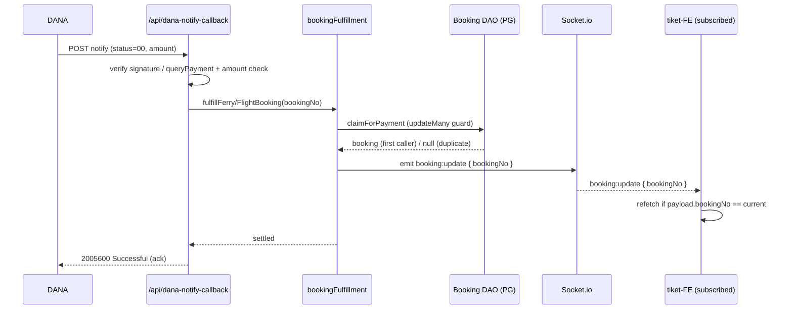

# 06 — Real-Time & Webhooks

Grounded in `socket.js`, `bin/www`, `services/bookingFulfillment.js`, `services/chatService.js`, and
`routes/api/dana-notify-callback.js`. The DANA webhook internals are detailed in
[`04-PAYMENTS-DANA.md`](04-PAYMENTS-DANA.md); integration/tooling context is in [`05-INTEGRATIONS.md`](05-INTEGRATIONS.md).

## 1. Socket.io Architecture

Socket.io is initialized once against the HTTP server in `bin/www`:

```js
require("../socket").init(server);
```

`socket.js` is a small singleton module:

- **`init(server)`** — constructs the `Server`, wires connection handlers, returns `io`.
- **`getIo()`** — returns the singleton `io`, throwing `"Socket.io not initialized!"` if called before init.
  **All route/service code must emit via `require('../../socket').getIo()`** — never a direct import — so the
  same initialized instance is shared. `bookingFulfillment.js` follows this exactly.
- **`getActiveVisitors()`** — exposes a simple in-memory visitor counter.

CORS mirrors the HTTP layer: only `localhost`/`127.0.0.1` (and no-origin) connections are accepted in-process;
production CORS is handled at the Nginx proxy.

### 1.1 Connection-level events (`io.on("connection")`)
| Event | Direction | Effect |
|-------|-----------|--------|
| `visitor_connected` | in | increments `activeVisitors`, broadcasts `visitors_update` |
| `visitors_update` | out (broadcast) | `{ activeVisitors }` |
| `chat:message` | in | `{ sessionId, text }` → `chatService.processMessage(sessionId, text, socket)` |
| `disconnect` | in | decrements `activeVisitors`, broadcasts `visitors_update` |

### 1.2 Chat events (emitted by `chatService`)
| Event | Payload |
|-------|---------|
| `chat:typing` | typing indicator (emitted around model/tool turns) |
| `chat:tool_result` | typed intermediate results (flight/ferry lists, customer-service card, payment) |
| `chat:response_done` | final assistant message for the turn |
| `chat:error` | `{ message }` on failure |

The AI assistant is Socket.io-only (no REST). Model/endpoint/tooling: [`05-INTEGRATIONS.md`](05-INTEGRATIONS.md).

## 2. `booking:update` Propagation

`booking:update` is emitted exactly once per successful settlement, from `emitBookingUpdate(bookingNo)` in
`services/bookingFulfillment.js`, after the atomic payment claim succeeds:

```js
require('../socket').getIo().emit("booking:update", { bookingNo });
```

- Emitted for **both** flight and ferry fulfillment, immediately after the claim (before the async
  voucher/email work), so the frontend refreshes as soon as the payment is settled.
- Wrapped in try/catch — a socket failure is logged and never breaks fulfillment or the webhook ack.
- The payload is minimal (`{ bookingNo }`); the frontend refetches booking state and matches on `bookingNo`.
- The emit is a **broadcast** to all connected clients (no per-booking rooms); clients filter by `bookingNo`.



## 3. Webhooks Inventory

| Webhook | Method / Path | Auth model |
|---------|---------------|------------|
| DANA Finish Notify | `POST /api/dana-notify-callback` | SNAP signature (DANA public key) **or** `queryPayment` fallback + amount verification |

There are **no other inbound webhooks** — in particular **no Midtrans webhook** exists (Midtrans was removed;
see [`03-API-REFERENCE.md`](03-API-REFERENCE.md) and [`04-PAYMENTS-DANA.md`](04-PAYMENTS-DANA.md)).

### 3.1 Notify → real-time chain (summary)
1. Raw body captured by `express.json({ verify })` (`app.js`) into `req.rawBody`.
2. Verify (public key) or fall back to `queryPayment` confirmation.
3. Sandbox amount `11012.00` → intentional 500 (UAT scenario).
4. Amount check vs stored `totalSales`.
5. Idempotent `claimForPayment` → `booking:update` emit → async voucher/email.
6. Ack `2005600`. Full step list in [`04-PAYMENTS-DANA.md`](04-PAYMENTS-DANA.md) §4.

**No polling.** State propagation is push-only via `booking:update`; the frontend does not poll on an interval.
